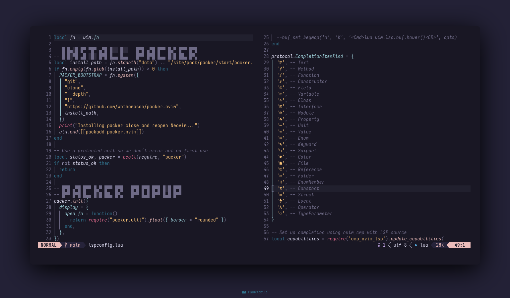
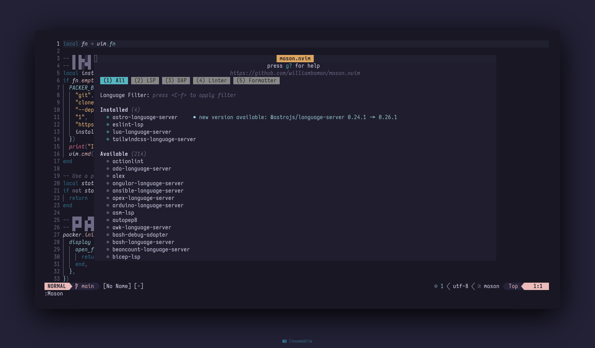
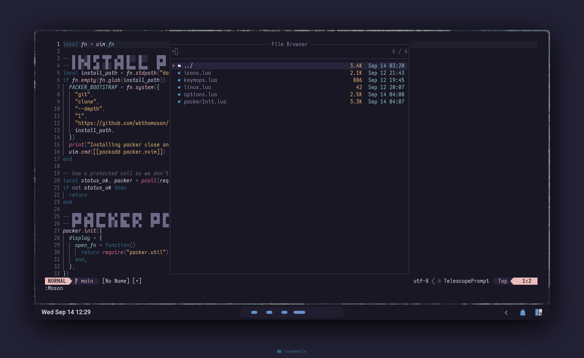
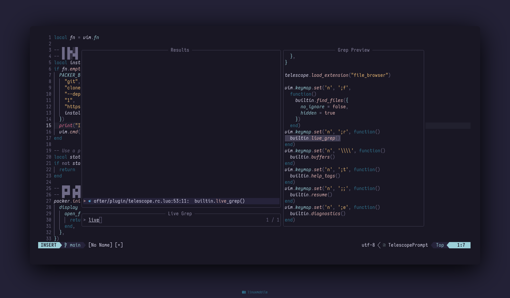
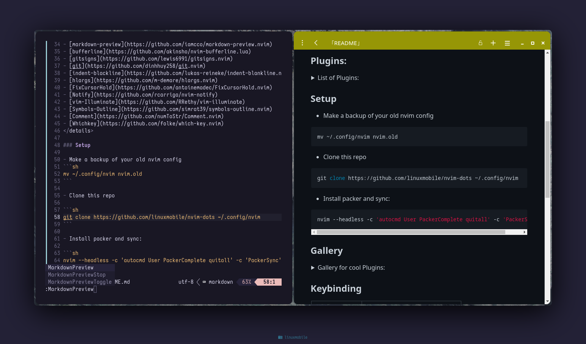
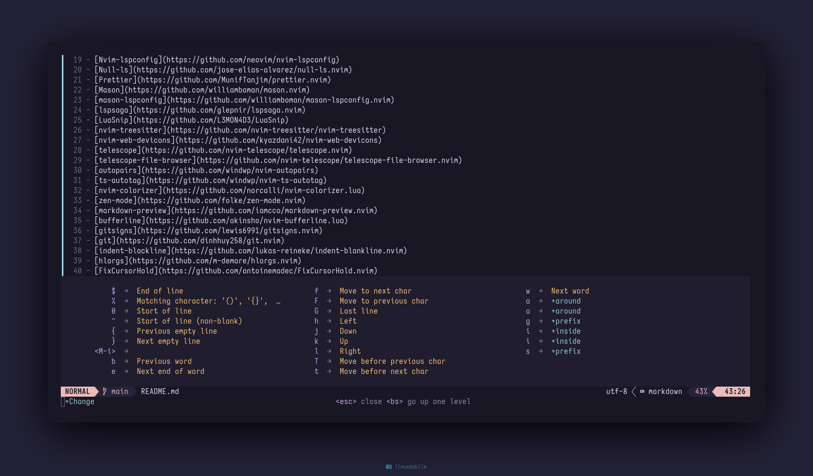
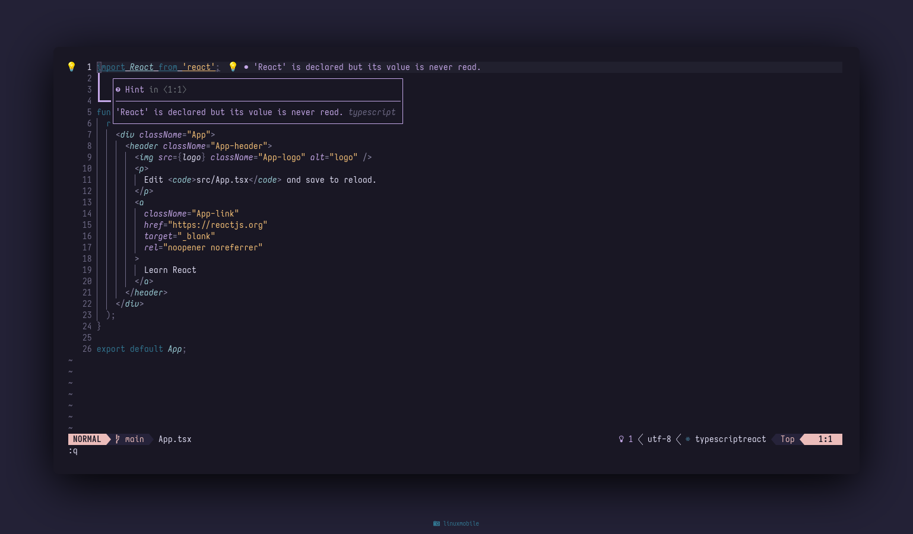
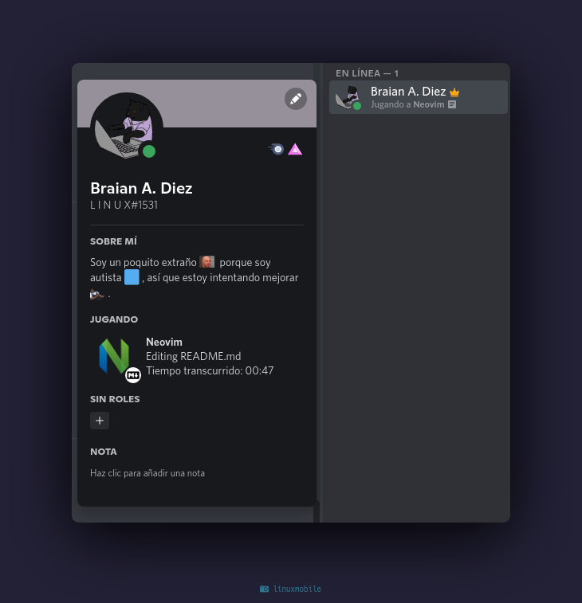

<h1 align="center">MERN Nvim Config</h1>

## Showcase



### Plugins:
<details>
<summary>List of Plugins:</summary>

- [Packer](https://github.com/wbthomason/packer.nvim)
- [Impatient](https://github.com/lewis6991/impatient.nvim)
- [Plenary](https://github.com/nvim-lua/plenary.nvim)
- [Lualine](https://github.com/nvim-lualine/lualine.nvim)
- [Lspkind](https://github.com/onsails/lspkind-nvim)
- [Cmp-Buffer](https://github.com/hrsh7th/cmp-buffer)
- [Cmp-nvim-lsp](https://github.com/hrsh7th/cmp-nvim-lsp)
- [Nvim-cmp](https://github.com/hrsh7th/nvim-cmp)
- [Nvim-lspconfig](https://github.com/neovim/nvim-lspconfig)
- [Null-ls](https://github.com/jose-elias-alvarez/null-ls.nvim)
- [Prettier](https://github.com/MunifTanjim/prettier.nvim)
- [Mason](https://github.com/williamboman/mason.nvim)
- [mason-lspconfig](https://github.com/williamboman/mason-lspconfig.nvim)
- [lspsaga](https://github.com/glepnir/lspsaga.nvim)
- [LuaSnip](https://github.com/L3MON4D3/LuaSnip)
- [nvim-treesitter](https://github.com/nvim-treesitter/nvim-treesitter)
- [nvim-web-devicons](https://github.com/kyazdani42/nvim-web-devicons)
- [telescope](https://github.com/nvim-telescope/telescope.nvim)
- [telescope-file-browser](https://github.com/nvim-telescope/telescope-file-browser.nvim)
- [autopairs](https://github.com/windwp/nvim-autopairs)
- [ts-autotag](https://github.com/windwp/nvim-ts-autotag)
- [nvim-colorizer](https://github.com/norcalli/nvim-colorizer.lua)
- [zen-mode](https://github.com/folke/zen-mode.nvim)
- [markdown-preview](https://github.com/iamcco/markdown-preview.nvim)
- [bufferline](https://github.com/akinsho/nvim-bufferline.lua)
- [gitsigns](https://github.com/lewis6991/gitsigns.nvim)
- [git](https://github.com/dinhhuy258/git.nvim)
- [indent-blackline](https://github.com/lukas-reineke/indent-blankline.nvim)
- [hlargs](https://github.com/m-demare/hlargs.nvim)
- [FixCursorHold](https://github.com/antoinemadec/FixCursorHold.nvim)
- [Notify](https://github.com/rcarriga/nvim-notify)
- [vim-Illuminate](https://github.com/RRethy/vim-illuminate)
- [Symbols-Outline](https://github.com/simrat39/symbols-outline.nvim)
- [Comment](https://github.com/numToStr/Comment.nvim)
- [Whichkey](https://github.com/folke/which-key.nvim)
- [Presence](https://github.com/andweeb/presence.nvim)
</details>

### Setup 

- Make a backup of your old nvim config
```sh
mv ~/.config/nvim nvim.old
```

- Clone this repo

```sh
git clone https://github.com/linuxmobile/nvim-dots ~/.config/nvim
```

- Install packer and sync:

```sh
nvim --headless -c 'autocmd User PackerComplete quitall' -c 'PackerSync'
```

### Gallery 

<details>
<summary>Gallery for cool Plugins:</summary>














</details>

### Keybinding

  |    Keybinds    |                Info               |
  | -----          | -----                             |
  | Tab            | Next Buffer                       |
  | Shift + Tab    | Previous Buffer                   |
  | s + s          | Open a horizontal split           |
  | s + v          | Open a vertical split             |

__Wait for update!__

## Special Thanks
- [Mangeshrex](https://github.com/Mangeshrex)
- [Manas140](https://github.com/Manas140/)
- [Craftzdog](https://github.com/craftzdog)
- [NvChad](https://github.com/NvChad/)
